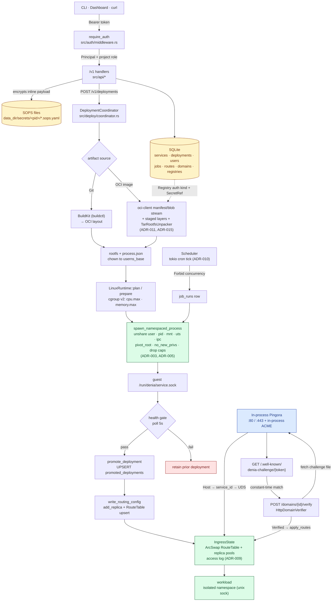

# Denia

Denia is a Docker-free, single-node PaaS. It deploys and runs services with a
Denia-owned Linux runtime (namespaces + cgroup v2) instead of Docker,
containerd, or runc, and exposes a versioned `/v1` management API behind a
bearer admin token.

It is built for solo operators and homelab users running self-hosted workloads
on a single node: deploy services, manage routes and secrets, and read real
cgroup/procfs runtime metrics. The goal is a tool you trust enough to forget
about, opening it only to do a thing and leave.

> Status: **v1, single-node.** Multi-node scheduling, hosted registry push, and
> rootless operation are intentionally deferred. See the ADRs and the active
> specs/plans under `docs/superpowers/`.

## Architecture

A single Rust binary contains both the HTTP control plane and the node agent,
separated internally so they can split later if a multi-node ADR is accepted.

- **HTTP API** — `axum`, versioned under `/v1`, protected by a bearer admin token.
- **State** — SQLite (`rusqlite`, bundled) for services, credentials metadata,
  artifacts, deployments, runtime status, routes, and recent
  metric snapshots.
- **Secrets** — SOPS-encrypted files; SQLite stores **references only**, never
  raw secret values. Default backend is a host-local age identity with
  root-only permissions.
- **Artifacts** — two v1 sources: Git over SSH built via BuildKit, and external
  OCI image pulls performed **in-process** via `oci-client` +
  `TarRootfsUnpacker` (no `skopeo`/`umoci` host binaries). Registry pulls stream
  layer blobs into temporary files under the artifact directory before verified
  extraction (ADR-015). Private registry auth is project-scoped through
  `Registry` records and SOPS `SecretRef`s, including Basic, bearer token,
  ECR-token, and GAR-token mappings (ADR-014).
- **Runtime** — `LinuxRuntime` launches workloads under `cgroup_v2 +
  unshare(user|pid|mount|uts|ipc) + no_new_privs + bounded-caps` and places
  them in `<cgroup_root>/<service_id>/<deployment_id>/<replica_index>` cgroups.
  Host paths are keyed off the globally-unique `service_id`, so the same service
  name across projects is isolated on disk. Every workload — including a single
  instance — boots into a **private per-replica overlay filesystem** (shared
  read-only artifact rootfs as `lower`, per-replica writable `upper`/`work`,
  helper binaries bind-mounted read-only) so replicas never clobber each other
  and the content-addressed bundle is never mutated (ADR-019). Host root is the
  trust boundary; agent runs rootful.
- **Autoscaling** — Per-service horizontal autoscaling (HPA-like). A control
  loop samples per-replica CPU/memory from cgroup v2 and scales replicas between
  `min_replicas` and `max_replicas` toward `target_cpu_pct` /`target_mem_pct`,
  with a scale-down cooldown. Idle services scale to zero; the first request
  reactivates them via a single-flight cold-start inside the in-process proxy. A
  resource ledger reserves CPU/memory against detected host capacity (minus
  configured headroom) so scale-ups can't oversubscribe the node. Redeploys
  roll replicas one at a time; boot reconcile adopts surviving replicas and
  cleans orphaned overlay layers (ADR-018).
- **Ingress** — Denia is its own L7 proxy: an in-process Pingora (0.8,
  boringssl) `ProxyHttp` binds `:80`/`:443`; see [In-Process Ingress](#in-process-ingress)
  below. `upstream_peer` resolves the `Host` header to a service and dials the
  workload's Unix socket directly (`HttpPeer::new_uds`) — no Traefik, no loopback
  bridge. It fans out across a service's healthy replica pool round-robin; with
  zero healthy replicas it single-flights a cold-start and holds the connection
  until a replica is ready (or replies 503). TLS is terminated in-process: ACME
  via `instant-acme` (HTTP-01), per-SNI certs from a `TlsAccept` callback, with
  an HTTP→HTTPS redirect for `tls_enabled` hosts (ADR-020, retains ADR-007's
  `tls_enabled` model). The `logging()` phase records request line + status into
  an in-process access log (ADR-009).
- **RBAC** — Users, sessions, API tokens, and project-scoped roles
  (Viewer/Operator/Admin) plus a bootstrap super-admin. Every `/v1` route
  resolves a `Principal` and enforces a project-scoped role minimum (ADR-008).
- **Projects** — Services are grouped into projects with shared env and
  default resource limits; `effective_env` and `effective_limits` are merged
  into each runtime start (ADR-006).
- **Jobs** — Run-to-completion jobs with cron schedules + in-process
  tokio scheduler, run-history with status + exit code, and Forbid concurrency
  (409 on duplicate manual run) (ADR-010).
- **Observability** — Node CPU/mem/disk/load via procfs + statvfs, per-service
  request log + workload roll-up (ADR-009).
- **Metrics** — cgroup v2 + procfs, read by `service_id`.

Source modules (`src/`): `api`, `app`, `auth`, `command`, `config`, `deploy`,
`domain`, `repo`, `state`, `secrets`, `artifacts`, `oci` (in-process
puller/unpacker + credentials), `runtime`, `ingress` (pingora proxy + route
table + ACME/TLS, socket proxy), `observability` (access logs, service logs, service metrics,
node metrics), `autoscale` (scaler math, controller, resource ledger, replica
registry, usage sampler, lifecycle), `scheduler`, `verification`, `syscall`
(rustix chown/caps/ns + overlay/bind mounts + signal), `web`, and
`workload_launcher`.

Deployments are **health-gated**: Denia starts the new deployment, waits for the
configured HTTP health-check path and timeout, then atomically promotes routing
and retains the previous deployment for rollback.

## Workflow

End-to-end view of how a request reaches a workload, and how a deployment is
produced and promoted.



Key stage transitions in code: `create_deployment`
(`src/api/deployments.rs`) → `deploy_external_image_source` /
`deploy_git_source` (`src/deploy/coordinator.rs`) →
`ArtifactAcquirer::acquire_rootfs_bundle_from_image_config`
(`src/artifacts/acquirer.rs`) → `LinuxRuntime::plan` / `prepare`
(`src/runtime/linux.rs`) → `spawn_namespaced_process` (`src/syscall/ns.rs`) →
`wait_for_service_socket` (`src/runtime/fs_helpers.rs`) → `health.check` →
`promote_deployment` (`src/repo/sqlite/deployments.rs`) →
`write_routing_config` (`src/deploy/coordinator.rs`).

## Requirements

- Rust 2024 edition (stable toolchain).
- Linux host with **cgroup v2** and **systemd** (Ubuntu/Debian LTS baseline).
  Kernel **≥ 5.11** for overlayfs mounts inside the workload user namespace
  (per-replica isolation, ADR-019).
- `unshare` (util-linux) and `sops`. For Git sources: BuildKit (`buildctl`).
  OCI image acquisition is in-process — no `skopeo`/`umoci`. `no_new_privs` +
  capability-drop are applied via `rustix` in-process — no `setpriv`.
- For building the dashboard: `pnpm` + Node (TanStack Start). See `web/`.

## Build & Run

```bash
cargo build                 # baseline build
cargo build --release       # embeds the web dashboard from web/dist/client
```

The release binary embeds the built SPA (`web/dist/client`) via `rust-embed`. In
debug builds the assets are read from disk. Build the frontend first when you
want the console served:

```bash
cd web && pnpm install && pnpm build
```

Run the control plane:

```bash
export DENIA_ADMIN_TOKEN=<your-token>   # required
cargo run --release
```

The server binds `127.0.0.1:7180` by default and serves the API under `/v1`,
with the dashboard as a fallback for non-API routes.

## Installation

Production installs use a two-step flow:

**Step 1 — Build and install the binary:**

```bash
sudo ./install.sh
```

`install.sh` must be invoked via **sudo from a regular user account** (not
directly as root). It runs preflight checks, installs OS dependencies, sets
up Rust (via `rustup`) and Node, builds the release binary (with the embedded
SPA), and copies it to `/usr/local/bin/denia`.

`--dry-run` previews every command without changing anything. `--skip-build`
reuses an existing `target/release/denia`.

**Step 2 — Provision the host:**

```bash
sudo denia setup
```

`denia setup` creates the `denia` system user and group, lays out
`/var/lib/denia`, generates `~/.config/denia/{config.toml,admin.token,age.key}`
owned `<operator>:denia 0640`, writes and enables the systemd unit, and starts
the service. That user becomes the operator: their `~/.config/denia/` is
editable without sudo. See [ADR-024](docs/adr/024-cli-driven-host-provisioning.md).

### Subcommands

| Subcommand | Purpose |
|------------|---------|
| `denia setup` | Provision the host (user, dirs, keys, config, systemd unit, start). |
| `denia uninstall [--purge]` | Stop and remove the service; `--purge` also wipes `/var/lib/denia` and `~/.config/denia`. |
| `denia status` | Print service state (systemctl status + recent journal lines). |
| `denia doctor` | Diagnose host requirements and install health (no privilege needed). |
| `denia rotate-token` | Rotate the admin token in `~/.config/denia/admin.token` and restart the service. |
| `denia --version` / `denia --help` | Print version string or usage. |

### What it sets up

| Path | Purpose | Owner / Mode |
|------|---------|--------------|
| `/usr/local/bin/denia` | Release binary (multi-call: also the in-namespace socket proxy) | `root:root 0755` |
| `/etc/systemd/system/denia.service` | Hardened systemd unit | `root:root 0644` |
| `~/.config/denia/config.toml` | TOML config (operator-editable) | `<user>:denia 0640` |
| `~/.config/denia/admin.token` | Bootstrap bearer (`DENIA_ADMIN_TOKEN=…`) | `<user>:denia 0640` |
| `~/.config/denia/age.key` | Age identity for SOPS encryption (ADR-021) | `<user>:denia 0640` |
| `/var/lib/denia/` | Data dir: SQLite, artifacts, runtime, logs, TLS, OCI cache | `denia:denia 0700` |
| `/sys/fs/cgroup/denia/` | cgroup v2 parent for workloads (delegated) | `denia:denia 0755` |

The three files under `~/.config/denia/` are mode `0640` owned `<user>:denia`
so the human reads + writes without sudo and the daemon (running as the
`denia` user, in the `denia` group) reads via the group bits. The daemon
never writes to the config directory.

### Privilege model

`denia.service` does **not** run as root. It runs as the unprivileged
`denia` system user with a tightly-scoped capability set granted via
`AmbientCapabilities=`:

- `CAP_NET_BIND_SERVICE` — bind Pingora to `:80` / `:443`
- `CAP_SYS_ADMIN` — create user / mount / pid / uts / ipc namespaces, write
  cgroup v2 controllers, perform bind mounts and `pivot_root`
- `CAP_SETUID` / `CAP_SETGID` — write the child's `uid_map` / `gid_map` and
  drop into the mapped user before exec (see `src/syscall/ns.rs`)

`CapabilityBoundingSet=` is locked to the same set, so a setuid child cannot
pick up additional caps. cgroup v2 controllers are explicitly delegated to
denia's slice via `Delegate=yes`. `NoNewPrivileges=` is intentionally `false`
at the unit level — the workload launcher applies `no_new_privs` and the
bounding-set drop **per spawned workload** via `rustix`
(`src/syscall/caps.rs`); doing it at the unit level would block the parent
from configuring children.

`ProtectHome=true` hides the operator's home directory from the daemon's
mount namespace; `BindReadOnlyPaths=~/.config/denia` then bind-mounts only
that subdirectory back in read-only. The daemon sees its config and nothing
else under `/home`.

> **Treat `CAP_SYS_ADMIN` as root-equivalent for threat modeling.** A process
> holding it can mount, unmount, manipulate namespaces, and write cgroup
> controllers — enough to take over the host if the daemon is compromised.
> See the **Security** section below for residual risk and mitigations.

### Editing config

```bash
$EDITOR ~/.config/denia/config.toml      # no sudo needed
sudo systemctl restart denia              # restart picks up the changes
journalctl -u denia -f                    # tail the log
```

The systemd unit pins `DENIA_CONFIG_FILE` and `SOPS_AGE_KEY_FILE`; everything
else flows from `config.toml`. Per-field `DENIA_*` environment variables in
the unit still override the file (env wins; see ADR-023).

### Bootstrap admin user

The token in `~/.config/denia/admin.token` is a super-admin bearer. Exchange
it once for a real admin account:

```bash
TOKEN="$(sed -n 's/^DENIA_ADMIN_TOKEN=//p' ~/.config/denia/admin.token)"
curl -fsS -X POST \
  -H "Authorization: Bearer $TOKEN" \
  -H 'Content-Type: application/json' \
  -d '{"username":"admin","password":"<strong-password>"}' \
  http://127.0.0.1:7180/v1/bootstrap
```

Or open the dashboard's `/setup` page and paste the token there.

### Manual install

If you prefer not to run `install.sh`, replicate it by hand. The
authoritative reference is the script itself; the steps are:

1. Build the binary (with the embedded SPA): `cd web && pnpm install && pnpm build && cd .. && cargo build --release`.
2. `sudo install -Dm0755 target/release/denia /usr/local/bin/denia`.
3. Create the system user + group + data layout under `/var/lib/denia` and
   delegate `/sys/fs/cgroup/denia` (see `install.sh::step_create_user` and
   `step_create_layout`).
4. Generate `~/.config/denia/age.key` with `age-keygen` and a 64-hex
   `~/.config/denia/admin.token` (`DENIA_ADMIN_TOKEN=...` line). Chown both
   `<user>:denia`, chmod `0640`.
5. Write `~/.config/denia/config.toml` mirroring
   `install.sh::write_config_file`.
6. Drop the unit from `install.sh::write_systemd_unit` into
   `/etc/systemd/system/denia.service`, substituting your paths.
7. `sudo systemctl daemon-reload && sudo systemctl enable --now denia`.

## Configuration

Configuration is read from a TOML file (`FileConfig` in `src/config.rs`).
The daemon writes a fully-populated default template on first boot if the
file is missing; the embedded `admin_token` is freshly generated. Every
field can be overridden per-field by a `DENIA_*` environment variable — env
wins. The systemd unit produced by `install.sh` pins `DENIA_CONFIG_FILE` to
`~/.config/denia/config.toml` for the installing operator. See
[ADR-023](docs/adr/023-toml-config-file.md).

Path resolution (first match wins): `$DENIA_CONFIG_FILE` → `$XDG_CONFIG_HOME/denia/config.toml`
→ `$HOME/.config/denia/config.toml` → `/root/.config/denia/config.toml`.

| Env override | TOML key | Default | Purpose |
|--------------|----------|---------|---------|
| `DENIA_ADMIN_TOKEN` | `admin_token` | auto-generated 64 hex on first run | Bootstrap bearer for `/v1`; minimum 64 chars |
| `DENIA_BIND_ADDR` | `bind_addr` | `127.0.0.1:7180` | Listen address |
| `DENIA_DATA_DIR` | `data_dir` | `/var/lib/denia` | Root for state, artifacts, runtime, logs |
| `DENIA_DATABASE_PATH` | `database_path` | `<data_dir>/denia.sqlite3` | SQLite path |
| `DENIA_BUILDKIT_BINARY` | `buildkit_binary` | `buildctl` | BuildKit client binary |
| `DENIA_SOPS_BINARY` | `sops_binary` | `sops` | SOPS binary |
| `DENIA_SOCKET_PROXY_BINARY` | `socket_proxy_binary` | current executable | Binary injected into workload rootfs as the socket proxy |
| `DENIA_CGROUP_ROOT` | `cgroup_root` | `/sys/fs/cgroup/denia` | Root for Denia-owned workload cgroups |
| `DENIA_ACME_EMAIL` | `acme_email` | — (required when any service uses TLS) | ACME account email; omit on nodes with no TLS service |
| `DENIA_HTTP_PORT` | `http_port` | `80` | Pingora `:80` (HTTP + ACME/denia challenge + HTTP→HTTPS redirect) |
| `DENIA_HTTPS_PORT` | `https_port` | `443` | Pingora `:443` (TLS, per-SNI certs) |
| `DENIA_ACME_DIRECTORY_URL` | `acme_directory_url` | Let's Encrypt prod | ACME directory; set the LE **staging** URL for non-prod to avoid rate-limit burns |
| `DENIA_TLS_DIR` | `tls_dir` | `<data_dir>/tls` | ACME account key + per-domain certs (`0600` in `0700` dirs) |
| `DENIA_CONTROL_DOMAIN` | `control_domain` | — | Optional ingress router for the control plane itself |
| `DENIA_CONTROL_TLS` | `control_tls` | `false` | TLS on the control-plane router |
| `DENIA_USERNS_BASE` | `userns_base` | `100000` | uid/gid base for the workload user namespace |
| `DENIA_USERNS_SIZE` | `userns_size` | `65536` | uid/gid range size for the workload user namespace |
| `DENIA_NODE_DISK_PATH` | `node_disk_path` | `<data_dir>` | Path used for `statvfs` disk metrics |
| `DENIA_AUTOSCALE_INTERVAL_S` | `autoscale_interval_s` | `15` | Autoscale control-loop tick interval (seconds) |
| `DENIA_AUTOSCALE_HEADROOM_CPU_MILLIS` | `autoscale_headroom_cpu_millis` | `1000` | CPU (millicores) held back from the autoscale resource ledger |
| `DENIA_AUTOSCALE_HEADROOM_MEM_BYTES` | `autoscale_headroom_mem_bytes` | `536870912` | Memory (bytes) held back from the autoscale resource ledger |
| `DENIA_AGE_RECIPIENT` | `age_recipient` | auto-derived from `age_key_file` | Age public key used to SOPS-encrypt registry credentials. Required to create non-anonymous registries via `/v1/projects/{pid}/registries`. See ADR-021. |
| `DENIA_AGE_KEY_FILE` | `age_key_file` | `~/.config/denia/age.key` | Age private key file. When `age_recipient` is unset, the daemon reads the `# public key:` comment from this file to derive it. Same format `age-keygen` writes. |

Derived paths: `runtime/`, `artifacts/`, `logs/`, and SOPS files under
`secrets/<project_id>/*.sops.yaml` below `data_dir`. Registry credentials are
configured by POSTing the raw payload (`username`/`password` or `token`) to
`/v1/projects/{project_id}/registries`; the control plane SOPS-encrypts it
under the project's secrets directory and stores a generated `credential_ref`
on the registry row. See ADR-021. `SOPS_AGE_KEY_FILE` is required for
SOPS decryption at deploy time and is set by the systemd unit; it may point
at the same file as `age_key_file`. Denia no longer has `ecr`/`gar` Cargo
features or `DENIA_ECR_*` / `DENIA_GAR_*` process-wide registry auth
variables.

## In-Process Ingress

Denia is its own L7 proxy — there is no external Traefik and no loopback bridge.
An in-process Pingora (0.8, boringssl) `Server` runs on a dedicated thread (via
`Server::run(RunArgs { shutdown_signal, .. })`, fed by Denia's shutdown channel)
and binds `:80`/`:443`. The `DeniaProxy` resolves the `Host` header to a service
through an in-memory `RouteTable` and dials the workload's Unix socket directly
with `HttpPeer::new_uds`. Route, scale, and cert changes apply live by swapping
`ArcSwap` state — no process restart.

TLS is terminated in-process. ACME (`instant-acme`, HTTP-01) issues and renews
certs for `tls_enabled` services whose domains are verified; the `:80`
`request_filter` serves `/.well-known/acme-challenge/*` (and `denia-challenge`)
by proxying to the control-plane backend. A `TlsAccept` callback selects the cert
by SNI from an `ArcSwap<CertStore>`; unknown SNI declines cleanly. Account key and
leaf certs are written atomically at `0600` in `0700` dirs under `DENIA_TLS_DIR`
and boot-loaded before `:443` accepts.

Management is unconditional — the operator must not run a separate proxy on the
same node. **Upgrade note:** if you previously ran Traefik (managed or manual),
**stop it before starting this version.** Denia owns `:80`/`:443`; a conflicting
process causes a bind failure that is logged while the control plane keeps
serving on `DENIA_BIND_ADDR`. Set `DENIA_ACME_DIRECTORY_URL` to the Let's Encrypt
**staging** directory on non-prod nodes to avoid burning production rate limits.

See ADR-020 for the full design rationale (supersedes ADR-016).

## Autoscaling

Each service carries an optional `AutoscalePolicy`:

| Field | Meaning |
|-------|---------|
| `min_replicas` | Floor (0 enables scale-to-zero) |
| `max_replicas` | Ceiling |
| `target_cpu_pct` | Target average CPU utilization driving scale-up |
| `target_mem_pct` | Optional target average memory utilization |
| `scale_down_cooldown_s` | Minimum quiet period before removing a replica |
| `idle_timeout_s` | Idle duration before scaling to zero |

A control loop (`DENIA_AUTOSCALE_INTERVAL_S`) samples per-replica cgroup CPU and
memory, computes the desired replica count against the targets, and launches or
drains replicas within the policy bounds. A resource ledger reserves each
replica's CPU/memory against detected host capacity minus headroom
(`DENIA_AUTOSCALE_HEADROOM_*`), so scale-ups never oversubscribe the node.

Replicas are stateless cattle: each runs in a private overlay rootfs (ADR-019),
gets a per-replica cgroup, and registers a Unix socket the in-process proxy fans
out to round-robin. Scale-to-zero drains all replicas; the next inbound request
single-flights a cold-start and waits for readiness before proxying. Redeploys
replace replicas one at a time, and boot reconcile re-adopts replicas that
survived a control-plane restart while removing orphaned overlay layers.

See ADR-018 (autoscaling) and ADR-019 (per-replica filesystem isolation).

## API

`GET /healthz` is public. Everything under `/v1` requires `Authorization:
Bearer <token>` — either the bootstrap admin token (super-admin) or a
user session / API token issued by `/v1/auth/login` (ADR-008).

| Method | Path | Min role | Purpose |
|--------|------|----------|---------|
| `GET` | `/healthz` | public | Liveness probe |
| `POST` | `/v1/auth/login` | public | Issue a session token |
| `POST` | `/v1/auth/logout` | authenticated | Revoke the bearer session |
| `GET` | `/v1/me` | authenticated | Current principal + memberships |
| `POST` | `/v1/bootstrap` | super-admin | One-time: create the first real super-admin user |
| `GET` / `POST` / `DELETE` | `/v1/users{,/...}` | super-admin | User management |
| `GET` / `POST` / `DELETE` | `/v1/api-tokens{,/...}` | authenticated | Caller's API tokens |
| `GET` | `/v1/projects` | viewer (membership-filtered) | List projects |
| `POST` | `/v1/projects` | super-admin | Create a project |
| `GET` | `/v1/projects/{id}` | viewer | Project detail |
| `DELETE` | `/v1/projects/{id}` | admin | Delete (only when empty) |
| `GET` / `POST` / `DELETE` | `/v1/projects/{id}/members{,/...}` | admin | Project membership |
| `GET` / `POST` | `/v1/projects/{id}/registries` | admin | List / create project registry auth config |
| `GET` / `PATCH` / `DELETE` | `/v1/projects/{id}/registries/{registry_id}` | admin | Registry detail / update / delete |
| `POST` | `/v1/credentials/{git,registry}` | super-admin | Register a SOPS-referenced credential |
| `GET` | `/v1/services` | viewer (membership-filtered) | List services |
| `POST` | `/v1/services` | operator | Create/update a service config (incl. autoscale policy) |
| `GET` | `/v1/services/{id}` | viewer | Service detail |
| `DELETE` | `/v1/services/{id}` | operator | Delete a service (ADR-017) |
| `POST` | `/v1/deployments` | operator | Create a deployment (Git or external image) |
| `GET` | `/v1/services/{id}/deployments` | viewer | List deployments |
| `GET` | `/v1/services/{id}/logs` | operator | Service logs |
| `GET` | `/v1/services/{id}/logs/stream` | operator | Live (streaming) service logs |
| `GET` | `/v1/services/{id}/metrics` | viewer | cgroup snapshots |
| `GET` | `/v1/services/{id}/requests` | operator | Recent access-log entries |
| `GET` / `POST` | `/v1/services/{id}/domains` | viewer / operator | List / add a domain (HTTP-verified before routing) |
| `POST` | `/v1/services/{id}/domains/{domain_id}/verify` | operator | Trigger HTTP file verification (409 if in flight) |
| `DELETE` | `/v1/services/{id}/domains/{domain_id}` | operator | Remove a domain |
| `GET` | `/.well-known/denia-challenge/{token}` | public | Verification challenge file (no auth; token is the secret) |
| `POST` | `/v1/services/{id}/{action}` | operator | Lifecycle (`stop`) |
| `GET` | `/v1/jobs?project_id=...` | viewer | List jobs |
| `POST` | `/v1/jobs` | operator | Create a job (cron or manual) |
| `GET` / `DELETE` | `/v1/jobs/{id}` | viewer / operator | Job detail / delete |
| `POST` | `/v1/jobs/{id}/run` | operator | Manual trigger (409 if a run is active) |
| `GET` | `/v1/jobs/{id}/runs` | viewer | Run history |
| `GET` | `/v1/ingress/routes` | super-admin | Live RouteSpec snapshot |
| `GET` | `/v1/metrics/node` | super-admin | NodeSnapshot (CPU/mem/disk/load) |
| `GET` | `/v1/workloads` | viewer (membership-filtered) | Running-workload roll-up incl. replica + healthy-replica counts |

Credentials store only a `secret_ref` pointing at a SOPS-encrypted file; raw
secret material never enters SQLite or logs.

## Dashboard

The operator dashboard lives in `web/` (TanStack Start / React 19, with an
Effect logic layer beneath TanStack Query). It is mono-forward and dark-primary
— see `PRODUCT.md` and `DESIGN.md` for the product brief and design system. The
built client is embedded into the release binary and served as the fallback for
non-`/v1` routes. Frontend work is out of scope for backend changes unless
explicitly requested.

## Verification

```bash
cargo build
cargo test
cargo fmt --all
cargo clippy --all-targets --all-features

# privileged runtime tests (root, namespaces, mounts, cgroup v2) — opt-in:
DENIA_RUN_PRIVILEGED_TESTS=1 cargo test --test linux_runtime_privileged -- --ignored
```

Privileged runtime tests are gated because they require root and mutate
namespaces, mounts, and cgroups. Normal CI stays unprivileged and covers
planning, path safety, and cgroup-file preparation against temp directories.
For narrower contract checks, `cargo test --test backend_contract` covers API
and deployment behavior, while `cargo test --test repo_contract` covers the
per-aggregate SQLite repositories.

## Security

### Trust model

- The Denia daemon is the trust boundary. It runs as the unprivileged `denia`
  system user but holds `CAP_SYS_ADMIN` plus `CAP_NET_BIND_SERVICE`,
  `CAP_SETUID`, `CAP_SETGID`. For threat-modeling purposes treat this as
  **host-root-equivalent**: any RCE in the daemon escalates to host root.
  This is the same class as `dockerd`, `containerd`, `kubelet`, and
  `podman` in rootful mode.
- Workloads run inside unprivileged user namespaces with their `uid 0`
  mapped to `userns_base` on the host (default `100000`), plus
  `no_new_privs` and a dropped capability bounding set. They cannot see
  host `uid 0` or escalate inside their namespace.
- The single-node design assumes the operator and the workloads belong to
  the same trust domain. Denia v1 is **not** a multi-tenant adversarial
  sandbox; if you need to run untrusted code on shared infrastructure, run
  each tenant on its own host or VM.

### Daemon hardening

The systemd unit shipped by `install.sh` confines the daemon beyond the
capability scope:

- `ProtectSystem=strict` — `/`, `/usr`, `/boot` read-only.
- `ProtectHome=true` + `BindReadOnlyPaths=~/.config/denia` — the operator's
  home is hidden; only the denia config dir is bind-mounted in read-only.
- `PrivateTmp=true` — private `/tmp`.
- `ProtectKernelLogs=true`, `ProtectKernelModules=true`, `ProtectClock=true`.
- `ReadWritePaths=/var/lib/denia /sys/fs/cgroup` — the only writable
  filesystem surfaces.
- `CapabilityBoundingSet=` locked to the four caps in `AmbientCapabilities`.

These are intentionally compatible with the operations the daemon must
perform. Do not enable `NoNewPrivileges=` at the unit level (breaks per-child
cap-drop), `PrivateUsers=` (breaks the userns workload model),
`RestrictNamespaces=` (breaks namespace creation), or
`ProtectControlGroups=` (breaks cgroup v2 writes).

### Operational hygiene

- **Bind the management API to loopback by default.** `bind_addr` defaults
  to `127.0.0.1:7180`; `install.sh` sets it to `0.0.0.0:7180` for
  local-network access. Narrow back to `127.0.0.1` or front with a reverse
  proxy + mTLS / VPN when exposing remotely.
- **Rotate the admin token.** `~/.config/denia/admin.token` is the
  super-admin bearer; treat it like a host-root credential. Use
  `/v1/auth/login` and per-user API tokens for day-to-day callers and
  reserve the bootstrap token for break-glass.
- **Patch the host kernel aggressively.** The realistic workload-escape
  vector is a user-namespace or cgroup CVE, not a Denia bug.
- **`cargo audit` on every release** for transitive RCE / advisory hits.
- **Never log secrets.** Tokens, SSH private keys, registry credentials, and
  decrypted SOPS payloads must never enter logs, traces, or error messages.
- **Validate external input** at the API and runtime boundary — service
  names, secret refs, domain strings, process manifests, registry URLs.

### Repo hygiene

- Never commit secrets, local keys, or generated private config.
- Never log passwords, tokens, SSH private keys, registry credentials, or
  decrypted SOPS payloads.

## References

- `docs/adr/README.md` and the ADRs: `001` backend architecture, `002` frontend
  Effect layer, `003` Linux runtime process runner (in-process namespace adapter
  amendment), `004` embedded web console, `005` runtime security hardening,
  `006` projects + versioned migrations, `007` ingress + TLS, `008`
  project-scoped RBAC, `009` observability, `010` jobs scheduler, `011`
  in-process OCI acquisition, `012` `src/` modularization, `013` domain
  verification, `014` per-service registry, `015` streaming OCI layer staging,
  `016` managed Traefik (superseded by 020), `017` service CRUD API, `018`
  autoscaling, `019` per-replica runtime filesystem isolation, `020` in-process
  Pingora ingress.
- `docs/superpowers/specs/` and `docs/superpowers/plans/` — design specs and
  implementation plans used to track active backend and console work.
- `CLAUDE.md` — agent/contributor guidelines.
- [Rust](https://www.rust-lang.org/) · [Axum](https://docs.rs/axum/) ·
  [SOPS](https://getsops.io/) · [Pingora](https://github.com/cloudflare/pingora)
