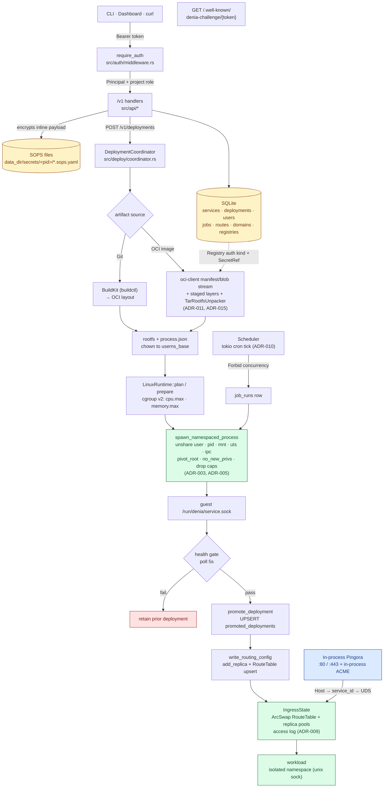

# Denia

> A Docker-free, single-node PaaS that runs your services on a Denia-owned Linux
> runtime — namespaces and cgroup v2 instead of Docker, containerd, or runc.

[](LICENSE)
[](https://www.rust-lang.org/)


Denia deploys and runs workloads under its own Linux runtime isolation and
exposes a versioned `/v1` management API behind a bearer admin token. It is its
own L7 ingress (in-process Pingora + ACME TLS), autoscales services down to zero,
and ships with an embedded web console — a single Rust binary, no external proxy,
no container runtime.

It is built for **solo operators and homelab users** running self-hosted
workloads on a single node: deploy services, manage routes and secrets, and read
real cgroup/procfs runtime metrics. The goal is a tool you trust enough to forget
about, opening it only to do a thing and leave.

> **Status: v1, single-node.** Multi-node scheduling, hosted registry push, and
> rootless operation are intentionally deferred. See the ADRs under `docs/adr/`.

## Contents

- [Why Denia?](#why-denia)
- [Features](#features)
- [Concepts](#concepts)
- [Quick Start](#quick-start)
- [Requirements](#requirements)
- [Installation](#installation)
- [Tutorial: deploy your first service](#tutorial-deploy-your-first-service)
- [Configuration](#configuration)
- [Secrets, environment & registries](#secrets-environment--registries)
- [Custom domains & TLS](#custom-domains--tls)
- [Architecture](#architecture)
- [API](#api)
- [Hosted registry](#hosted-registry)
- [Service console](#service-console)
- [Deploy from your machine](#deploy-from-your-machine)
- [Observability](#observability)
- [Operations](#operations)
- [Security](#security)
- [Troubleshooting & FAQ](#troubleshooting--faq)
- [Roadmap](#roadmap)
- [Contributing](#contributing)

## Why Denia?

Most self-hosted PaaS tools are a thin layer over Docker or Kubernetes: you still
run a container daemon, a separate reverse proxy, a cert companion, and a registry,
then wire them together. Denia collapses that stack into **one Rust binary** that
owns the whole path — runtime isolation, ingress, TLS, autoscaling, registry, and
an operator console — talking to the Linux kernel directly (namespaces + cgroup
v2) instead of going through a container runtime.

| | Denia | Docker / Compose | Dokku / CapRover | Kubernetes |
|---|---|---|---|---|
| Container runtime | **None** (kernel namespaces) | `dockerd` | `dockerd` | containerd / CRI |
| Reverse proxy | **Built-in** (Pingora) | Manual | Bundled (nginx) | Ingress controller |
| TLS / ACME | **Built-in** | Manual / companion | Bundled (Let's Encrypt) | cert-manager |
| Autoscale + scale-to-zero | **Built-in** | No | No | HPA + Knative |
| OCI registry | **Built-in** | External | External | External |
| Moving parts | One binary + `systemd` | Daemon + add-ons | Daemon + plugins | Many components |
| Scope | Single node | Single node | Single node | Cluster |

**Denia is for you if** you run your own apps on one Linux box, are comfortable
with the terminal and Linux primitives, and want a tool that handles the boring
plumbing without hiding what the machine is doing.

**Denia is not for you if** you need multi-node clustering, a managed control
plane, or a hardened multi-tenant sandbox for running untrusted third-party code
(see [Security](#security)).

## Features

- **Denia-owned runtime isolation** — workloads run under `unshare(user, pid,
  mount, uts, ipc)` + cgroup v2 + `no_new_privs` + a dropped capability bounding
  set. No Docker, containerd, or runc. Each replica boots a private per-replica
  overlay filesystem (ADR-019).
- **In-process L7 ingress** — an embedded Pingora (0.8, boringssl) proxy binds
  `:80`/`:443`, resolves the `Host` header to a service, and dials the workload's
  Unix socket directly. No Traefik, no loopback bridge (ADR-020).
- **In-process TLS / ACME** — per-SNI certs issued and renewed via `instant-acme`
  (HTTP-01); no certbot, no sidecar (ADR-007/ADR-020).
- **Horizontal autoscaling** — per-service CPU/memory-driven scaling with
  scale-to-zero and single-flight cold-start, bounded by a host resource ledger
  (ADR-018).
- **Two artifact sources** — Git over SSH built with BuildKit, and external OCI
  image pulls done **in-process** via `oci-client` (no `skopeo`/`umoci`)
  (ADR-011/ADR-015).
- **Projects + RBAC** — services grouped into projects with shared env/limits;
  project-scoped Viewer/Operator/Admin roles on every `/v1` route (ADR-006/ADR-008).
- **Jobs** — run-to-completion jobs with cron schedules and an in-process tokio
  scheduler (ADR-010).
- **SOPS-referenced secrets** — SQLite stores references only; raw secret values
  live in SOPS-encrypted files encrypted to a host-local age identity (ADR-021/ADR-023).
- **Embedded web console** — a static SPA served from the same binary on the same
  origin as `/v1` (ADR-004).
- **Live service console** — `kubectl exec`-style interactive `/bin/sh` into a
  running replica, from the web console's terminal or `denia console`. A
  PTY-backed `setns` joins the replica's namespaces + cgroup; auth is a single-use
  ticket, never a token in the URL (ADR-033).
- **Client-driven deploy** — `denia auth` to log in once (stores a long-lived
  API token), then `denia push` packs your working tree (honoring
  `.gitignore`/`.dockerignore`), uploads it, and the node builds the Dockerfile
  and deploys it — no local Docker required (ADR-034).

## Concepts

A small, stable vocabulary maps directly onto the API and the console:

- **Project** — the top-level grouping and the unit of access control. Holds
  shared environment/limits, members (with roles), and registry credentials.
  Every service belongs to exactly one project.
- **Role** — a member's permission level *within a project*: **Viewer** (read,
  redacted secrets), **Operator** (deploy, manage routes/secrets, open consoles),
  **Admin** (manage members). The bootstrap admin token is a super-admin across
  all projects.
- **Service** — a long-running workload: an image source (Git, external OCI
  image, or an uploaded build context), a listen port, env, optional
  domains/TLS, and an optional autoscaling policy.
- **Deployment** — one immutable build+release of a service. Deployments are
  health-gated: the new one must pass its HTTP health check before routing is
  promoted to it; the previous deployment is retained for rollback.
- **Replica** — a single running instance of a service's promoted deployment,
  isolated in its own namespaces + cgroup + overlay rootfs and reachable on a
  private Unix socket. The autoscaler adds and drains replicas.
- **Route / Domain** — a hostname mapped to a service. Ingress resolves the
  `Host` header to a service and dials its replicas. A custom domain must pass
  HTTP file verification before it can receive ACME-issued TLS.
- **Job** — a run-to-completion workload, triggered manually or on a cron
  schedule, on the same runtime as services.
- **Registry** — either a *project registry* (credentials for pulling external
  OCI images) or Denia's own *hosted registry* (`/v2`) that stores images you push.
- **Secret** — a sensitive value stored in a SOPS-encrypted file and *referenced*
  (never stored raw) by SQLite.

## Quick Start

For local development on a Linux host:

```bash
# 1. Build the web console (embedded into release builds)
cd web && pnpm install && pnpm build && cd ..

# 2. Set the bootstrap admin token (required)
export DENIA_ADMIN_TOKEN="$(openssl rand -hex 32)"

# 3. Run the control plane
cargo run --release
```

The server binds `127.0.0.1:7180` by default, serving the API under `/v1` with
the console as the fallback for non-API routes. For a production install, use the
[Installation](#installation) flow instead.

## Requirements

- **Rust 2024 edition** (stable toolchain).
- **Linux glibc ≥ 2.39** with **cgroup v2** and **systemd** (Ubuntu 24.04+
  baseline). Kernel **≥ 5.11** for overlayfs mounts inside the workload user
  namespace (per-replica isolation, ADR-019).
- **`sops`** for secret encryption/decryption.
- **BuildKit** (`buildctl`) — only for Git artifact sources. OCI image
  acquisition is in-process (no `skopeo`/`umoci`); `no_new_privs` + capability
  drop are applied in-process via `rustix` (no `setpriv`).
- **`pnpm` + Node** — only to build the web console (TanStack Start). See `web/`.

## Installation

Production installs use a two-step flow.

**Step 1 — Build and install the binary:**

```bash
sudo \
  DENIA_RUSTUP_SHA256=<known-good sha256 for https://sh.rustup.rs> \
  DENIA_NODESOURCE_SETUP_SHA256=<known-good sha256 for https://deb.nodesource.com/setup_22.x> \
  ./install.sh
```

`install.sh` must be run via **sudo from a regular user account** (not directly
as root). It runs preflight checks (OS/arch, glibc ≥ 2.39, cgroup v2, user
namespaces, free `:80`/`:443`), installs OS dependencies, sets up Rust (via
`rustup`) and Node, builds the release binary with the embedded SPA, and
installs it to `/usr/local/bin/denia`.

On `apt` systems, Denia also fetches the NodeSource setup script to install
Node 22 when it is not already present. Both downloaded scripts are verified
before running. To get the current hashes from a trusted network path:

```bash
curl --proto '=https' --tlsv1.2 -sSfL https://sh.rustup.rs -o rustup-init.sh
sha256sum rustup-init.sh
curl --proto '=https' --tlsv1.2 -fsSL https://deb.nodesource.com/setup_22.x -o nodesource-setup_22.x
sha256sum nodesource-setup_22.x
sudo \
  DENIA_RUSTUP_SHA256=<rustup sha256> \
  DENIA_NODESOURCE_SETUP_SHA256=<nodesource sha256> \
  ./install.sh
```

- `--dry-run` previews every command without changing anything.
- `--skip-build` reuses an existing `target/release/denia`.

**Step 2 — Provision the host:**

```bash
sudo denia setup
```

`denia setup` creates the `denia` system user and group, lays out
`/var/lib/denia`, generates `~/.config/denia/{config.toml,admin.token,age.key}`
(owned `<operator>:denia 0640` — editable without sudo), writes and enables the
systemd unit, and starts the service. See
[ADR-025](docs/adr/025-cli-driven-host-provisioning.md) for the full layout and
privilege model.

### CLI subcommands

| Subcommand | Purpose |
|------------|---------|
| `denia setup` | Provision the host (user, dirs, keys, config, systemd unit, start). |
| `denia uninstall [--purge]` | Stop and remove the service; `--purge` also wipes `/var/lib/denia` and `~/.config/denia`. |
| `denia status` | Print service state (systemctl status + recent journal lines). |
| `denia doctor` | Diagnose host requirements and install health (no privilege needed). |
| `denia rotate-token` | Rotate the admin token and restart the service. |
| `denia update [--check\|--tag <tag>\|--force\|-y]` | Self-update to the latest signed GitHub release binary and restart; `--check` only reports whether a newer release exists (no root). |
| `denia console [service]` | Open an interactive `/bin/sh` inside a running service replica (ticket + websocket). |
| `denia auth` | Authenticate to a remote Denia (login → mint + store an API token in `client.toml`). |
| `denia push` | Pack the working tree, upload it, and deploy to a remote service (Dockerfile required). |

Running `denia` with no subcommand starts the control-plane daemon.

### Bootstrap admin user

The token in `~/.config/denia/admin.token` is a super-admin bearer. Exchange it
once for a real admin account (or use the console's `/setup` page):

```bash
TOKEN="$(sed -n 's/^DENIA_ADMIN_TOKEN=//p' ~/.config/denia/admin.token)"
curl -fsS -X POST \
  -H "Authorization: Bearer $TOKEN" \
  -H 'Content-Type: application/json' \
  -d '{"username":"admin","password":"<strong-password>"}' \
  http://127.0.0.1:7180/v1/bootstrap
```

## Tutorial: deploy your first service

A complete deploy from a fresh install, using the `denia push` client flow — no
local Docker, no git remote, no pre-deploy commit. Assumes you have run
`sudo denia setup` and created an admin account via `/v1/bootstrap` (above).

**1. Create the service.** Services are created in the web console (recommended)
or with `POST /v1/services`. In the console: pick a project (a `default` project
exists on a fresh install), choose **Upload** as the source, set the listen port
and health-check path, and save. Note the service name.

**2. Authenticate the client** on your dev machine:

```bash
denia auth --url https://your-node.example.com
# prompts for username + password; mints and stores a long-lived API token (0600)
```

**3. Add a `.denia` manifest** to your project root so you don't repeat flags:

```toml
project    = "default"
service    = "api"
dockerfile = "Dockerfile"
context    = "."
```

**4. Push** from the project directory:

```bash
denia push
```

Denia packs your working tree (honoring `.gitignore`/`.dockerignore`), uploads it,
builds the Dockerfile with BuildKit on the node, runs the health-gated deploy, and
tails the build + deploy logs until the service reports `Healthy`.

**5. Expose it.** Attach a hostname and enable TLS — see
[Custom domains & TLS](#custom-domains--tls). Once the domain is verified and a
cert is issued, the service is live on `:443`.

**6. Inspect it** from the console, or over the API:

```bash
TOKEN=...   # an API token, e.g. from `denia auth`
SID=...     # the service id

# recent logs
curl -fsS -H "Authorization: Bearer $TOKEN" \
  https://your-node.example.com/v1/services/$SID/logs

# live runtime metrics (cgroup v2 + procfs)
curl -fsS -H "Authorization: Bearer $TOKEN" \
  https://your-node.example.com/v1/services/$SID/metrics
```

For an interactive shell inside a running replica, use `denia console <service>`
(see [Service console](#service-console)).

## Configuration

Configuration is read from a TOML file (`FileConfig` in `src/config.rs`); the
daemon writes a fully-populated default template on first boot. Every field can
be overridden by a `DENIA_*` environment variable — **env wins**. Path resolution
(first match wins): `$DENIA_CONFIG_FILE` → `$XDG_CONFIG_HOME/denia/config.toml` →
`$HOME/.config/denia/config.toml` → `/root/.config/denia/config.toml`. See
[ADR-023](docs/adr/023-toml-config-file.md).

Most-used settings (the full list lives in `src/config.rs`):

| Env override | TOML key | Default | Purpose |
|--------------|----------|---------|---------|
| `DENIA_ADMIN_TOKEN` | `admin_token` | auto-generated 64 hex | Bootstrap bearer for `/v1` (min 64 chars) |
| `DENIA_BIND_ADDR` | `bind_addr` | `127.0.0.1:7180` | Management API listen address |
| `DENIA_DATA_DIR` | `data_dir` | `/var/lib/denia` | Root for state, artifacts, runtime, logs |
| `DENIA_ACME_EMAIL` | `acme_email` | — | ACME account email (required when any service uses TLS) |
| `DENIA_HTTP_PORT` / `DENIA_HTTPS_PORT` | `http_port` / `https_port` | `80` / `443` | Pingora ingress ports |
| `DENIA_ACME_DIRECTORY_URL` | `acme_directory_url` | Let's Encrypt prod | Set the LE **staging** URL for non-prod to avoid rate-limit burns |
| `DENIA_AGE_KEY_FILE` | `age_key_file` | `~/.config/denia/age.key` | Age private key for SOPS; recipient auto-derived from it |

Registry credentials are not configured by env: POST the raw payload to
`/v1/projects/{project_id}/registries` and the control plane SOPS-encrypts it
(ADR-021).

## Secrets, environment & registries

Denia separates three kinds of configuration data:

- **Environment variables** — plain `KEY=value` pairs on a service (with shared
  defaults on its project). Stored in SQLite as part of the service config and
  injected into the workload. Viewers see env values **redacted**; only Operators
  and above see raw values over the API and console.
- **Secrets** — sensitive values that must not sit in the database in clear. These
  are written to **SOPS-encrypted files** under
  `<data_dir>/secrets/<project_id>/`, encrypted to a host-local **age** identity;
  SQLite stores only a reference. Decryption happens at deploy time via `sops`
  with `SOPS_AGE_KEY_FILE`. See
  [ADR-021](docs/adr/021-control-plane-secret-encryption.md) /
  [ADR-023](docs/adr/023-toml-config-file.md).
- **Registry credentials** — credentials for pulling private external OCI images.
  POST the raw payload to `POST /v1/projects/{project_id}/registries`; the control
  plane SOPS-encrypts it for you (no operator-managed `secret_ref`). A service then
  references the registry by `registry_id` + `image_ref`. Git deploy keys are
  managed the same way under `.../credentials/git`.

> The age private key (`~/.config/denia/age.key` by default) is the root of this
> scheme. Lose it and **every** SOPS-encrypted secret becomes unrecoverable — back
> it up first (see [Operations](#operations)).

## Custom domains & TLS

Denia is its own L7 ingress and ACME client — there is no separate Traefik/nginx
or certbot. Bringing a domain online is a verify-then-issue flow
([ADR-013](docs/adr/013-domain-verification.md),
[ADR-020](docs/adr/020-pingora-ingress.md)):

1. **Point DNS** at the node's public IP (`A`/`AAAA` record for the hostname).
2. **Attach the domain** to a service — `POST /v1/services/{id}/domains` (or the
   console). It starts **unverified**.
3. **Verify ownership** — `POST /v1/services/{id}/domains/{domain_id}/verify`.
   Denia serves a token at `GET /.well-known/denia-challenge/{token}` that is only
   returned when the request `Host` matches, so verification passes only once DNS
   resolves to this node.
4. **TLS is automatic.** Enable `tls_enabled` on the service (requires
   `DENIA_ACME_EMAIL`). For each **verified** domain Denia issues a cert over ACME
   HTTP-01 via `instant-acme`, serves it per-SNI, persists it `0600` under
   `<tls_dir>`, and renews it on a background scan.

Every hostname is run through `validate_domain` before it becomes a route, SNI, or
ACME identifier, and a service may not claim the node's own `control_domain`. For
non-production, set `DENIA_ACME_DIRECTORY_URL` to the Let's Encrypt **staging**
endpoint to avoid burning rate limits.

The control plane itself can be served over a domain on the same ingress by setting
`DENIA_CONTROL_DOMAIN` (+ `DENIA_CONTROL_TLS`); see
[ADR-035](docs/adr/035-control-domain-ingress.md).

## Architecture

A single Rust binary contains both the HTTP control plane and the node agent,
separated internally so they can split later if a multi-node ADR is accepted.

- **API** — `axum`, versioned under `/v1`, bearer-token protected.
- **State** — SQLite (`rusqlite`, bundled) for services, deployments, routes,
  credentials metadata, and recent metric snapshots. All persisted IDs are UUIDv7.
- **Secrets** — SOPS-encrypted files; SQLite holds **references only** (ADR-021/ADR-023).
- **Artifacts** — Git-over-SSH (BuildKit) and in-process OCI pulls (ADR-011/ADR-015).
- **Runtime** — `LinuxRuntime` launches workloads under namespaces + cgroup v2 +
  `no_new_privs` + bounded caps, each in a private overlay rootfs (ADR-003/ADR-005/ADR-019).
- **Autoscaling** — CPU/mem-driven scaling, scale-to-zero, host resource ledger (ADR-018).
- **Ingress / TLS** — in-process Pingora proxy + in-process ACME (ADR-020).
- **RBAC / Projects** — project-scoped roles and shared env/limits (ADR-006/ADR-008).
- **Jobs** — cron + manual run-to-completion jobs (ADR-010).
- **Observability** — access logs, service logs, node + service metrics from
  cgroup v2 / procfs / statvfs (ADR-009).

Source modules (`src/`): `api`, `app`, `auth`, `cli`, `command`, `config`,
`deploy`, `domain`, `repo`, `state`, `secrets`, `artifacts`, `oci`, `runtime`,
`ingress`, `observability`, `autoscale`, `scheduler`, `syscall`, `web`, and
`workload_launcher`.

Deployments are **health-gated**: Denia starts the new deployment, waits for the
configured HTTP health-check, then atomically promotes routing and retains the
previous deployment for rollback.

### Request & deployment flow



## API

`GET /healthz` is public. Everything under `/v1` requires `Authorization: Bearer
<token>` — either the bootstrap admin token (super-admin) or a session / API
token from `/v1/auth/login`. Routes enforce a project-scoped role minimum
(Viewer/Operator/Admin). The full route table is documented in
[ADR-008](docs/adr/008-rbac.md) and the `src/api/` handlers; highlights:

- `POST /v1/auth/login`, `GET /v1/me`, `POST /v1/bootstrap`
- `GET|POST /v1/projects`, `…/members`, `…/registries`
- `GET|POST /v1/services`, `GET /v1/services/{id}/{logs,metrics,requests,domains}`
- `POST /v1/deployments`, `GET /v1/services/{id}/deployments`
- `GET|POST /v1/jobs`, `POST /v1/jobs/{id}/run`, `GET /v1/jobs/{id}/runs`
- `GET /.well-known/denia-challenge/{token}` (public domain verification;
  token must match the request `Host`)
- `/v2/...` OCI Distribution routes (hosted registry; see below)
- `GET /v1/registry/status`, `POST /v1/registry/gc` (super-admin),
  `GET /v1/registry/repositories` (project-filtered)
- `GET /v1/services/{id}/console/replicas`, `POST /v1/services/{id}/console/tickets`
  (Operator); `GET /v1/services/{id}/console/ws` (single-use ticket, outside bearer
  auth — browser websockets can't send an `Authorization` header)
- `POST /v1/services/{id}/uploads` (Operator; streams a `tar.zst` build context)
- `GET /v1/node` (exposes `control_domain`)

## Hosted registry

Denia hosts its own OCI registry as a separate subsystem from the per-project
external pull registries (ADR-014/ADR-021). See [ADR-031](docs/adr/031-hosted-oci-registry.md).

- **Same-origin `/v2`** — the registry follows the OCI Distribution route shape
  and is mounted at `/v2` on the same origin as the management API, outside
  `/v1`. No dedicated registry hostname is required for the single-node install.
- **Bearer API token auth** — `/v2` reuses the same `Authorization: Bearer
  <token>` resolution as `/v1`, with its own per-repository role checks: push
  (`PUT`/`POST`/`PATCH`) requires project **Operator**, pull (`GET`/`HEAD`)
  requires **Viewer**. Docker-compatible login is a future amendment.
- **`<project>/<service>` naming** — repository names map to Denia project and
  service names, e.g. `/v2/default/api/manifests/latest`. Path segments are
  validated and must resolve to an existing project/service.
- **Local storage** — blob and manifest bytes are content-addressed under
  `data_dir/registry` (`blobs/sha256/<hex>`); upload sessions live under
  `registry/uploads/<uuidv7>/`. SQLite holds repository, manifest, tag, blob,
  upload, and GC-run metadata. Uploaded blobs are SHA-256-verified against the
  requested digest before being committed.
- **Garbage collection** — conservative GC reclaims unreferenced blobs older than
  a grace period; it never removes a blob referenced by a manifest or an active
  upload. It runs both on a periodic background task and on demand via
  `POST /v1/registry/gc`. Tunable with `DENIA_REGISTRY_GC_INTERVAL_SECS`
  (default 24h) and `DENIA_REGISTRY_GC_GRACE_SECS` (default 1h). Storage and GC
  status are visible in the web console under Settings → Hosted registry.

## Service console

An interactive shell into a live service replica — `kubectl exec`-style, but
through Denia's own runtime isolation rather than a Docker/containerd exec. Open
it from the web console's terminal or the CLI (see [ADR-033](docs/adr/033-service-console.md)):

```bash
denia console <service> [--project <name>] [--replica <index>]
```

- **Live replica attach** — attaches to a running replica of the service's
  **promoted** deployment. The runtime launches `/bin/sh` through a PTY-backed
  `setns` path that joins the replica's namespaces and cgroup; the existing
  service/job launcher is untouched.
- **Ticket + websocket auth** — the browser/CLI first mints a short-lived (30s)
  single-use console ticket over bearer-authenticated HTTP, then opens the
  websocket with that ticket. Bearer tokens never appear in a websocket URL.
  Minting a ticket requires project **Operator**. Binary frames carry terminal
  I/O; JSON text frames carry readiness, resize, exit, and error control messages.
- **Bounded sessions** — at most 16 concurrent console sessions process-wide and
  2 per service.
- **No transcript persistence** — terminal input/output is never stored. Denia
  records metadata-only audit events (principal, service/deployment id, replica
  index, session id, start/end, exit reason).
- **`/bin/sh` only (v1)** — images without `/bin/sh` (e.g. distroless) return a
  clear console error until an explicit command mode is added.

## Deploy from your machine

`denia push` deploys the current working tree to a remote Denia node — no local
Docker, no git remote, no pre-deploy commit. See
[ADR-034](docs/adr/034-client-driven-deploy-upload.md).

### Authenticate once

```bash
denia auth [--url <URL>] [--username <user>] [--profile <name>]
```

`denia auth` prompts for the remote URL, username, and password (hidden input).
It logs in via `/v1/auth/login`, mints a long-lived named API token via
`/v1/api-tokens`, and saves only `{url, token}` to
`~/.config/denia/client.toml` (mode `0600`). The password and the session token
are **never stored or logged**. The minted token is verified with `GET /v1/me`
before saving. Flags: `--url`, `--username`, `--profile`, `--token-name`,
`--password-stdin`.

### The `.denia` manifest

Commit a `.denia` file in the project root to record the target project and
service (and optionally the Dockerfile and context paths):

```toml
project    = "default"
service    = "api"
dockerfile = "Dockerfile"   # optional, default
context    = "."            # optional, default
```

An optional `[create]` block supplies defaults for `denia push --create`:

```toml
[create]
port         = 8080
health_path  = "/healthz"   # optional, default "/"
```

### Push a deploy

```bash
denia push [--project <name>] [--service <name>] [--dockerfile <path>]
           [--context <dir>] [--path <dir>] [--profile <name>] [--no-follow]
           [--create]
```

`denia push` resolves the target from `.denia` (flags override manifest values),
then:

1. Verifies the Dockerfile exists on disk.
2. Packs the working tree into a `tar.zst` build context — tracked and untracked
   files honoring `.gitignore` and `.dockerignore`; the Dockerfile is always
   included.
3. Streams the archive to `POST /v1/services/{id}/uploads`.
4. Creates a deployment with the returned `upload_id`
   (`POST /v1/deployments`, source `upload`).
5. Tails the SSE deploy-log stream and polls for `Healthy`/`Failed` status
   (suppressed with `--no-follow`).

The service **must already exist** (create it in the web console or via
`POST /v1/services`). The node builds the uploaded context with BuildKit and
runs the existing health-gated async deploy. The staged upload is deleted after
the build.

**`--create`** creates the service first, but only when the node has a
`control_domain` configured (it registers the service against the node's hosted
registry). Without a control domain `--create` is refused — create the service
in the console instead. A `[create]` block in `.denia` is required when using
`--create`.

### v1 constraints

- Builds are **Dockerfile-only** — no buildpacks or Nixpacks.
- Each push uploads a full context (no incremental upload).
- Build contexts may **not** contain symlinks (the server rejects archives with
  escaping symlinks or hardlinks for host-root safety).

## Observability

Denia surfaces real runtime state straight from the kernel — no metrics sidecar
([ADR-009](docs/adr/009-observability.md)):

- **Service logs** — recent lines via `GET /v1/services/{id}/logs`, or a live
  Server-Sent Events tail via `GET /v1/services/{id}/logs/stream` (bounded
  concurrent streams). Logs are keyed by service id.
- **Service metrics** — `GET /v1/services/{id}/metrics`: CPU and memory from the
  replica's **cgroup v2** controllers plus process stats from procfs.
- **Node metrics** — `GET /v1/node` reports host-level state (and exposes the
  configured `control_domain`); disk usage comes from `statvfs` on
  `DENIA_NODE_DISK_PATH`.
- **Access log** — the ingress records per-request entries; recent requests for a
  service are at `GET /v1/services/{id}/requests`.
- **Deploy logs** — each deployment has its own streamed log
  ([ADR-024](docs/adr/024-async-deployments.md)); `denia push` tails it for you.

All of this is also rendered in the web console.

## Operations

### Upgrades

```bash
sudo denia update                 # update to the latest signed release and restart
denia update --check              # report whether a newer release exists (no root)
sudo denia update --tag v0.2.0    # pin a specific release tag
sudo denia update --force         # reinstall even if not newer
```

`denia update` downloads the prebuilt binary for your architecture from the GitHub
release, verifies it against a **pinned minisign signature** over `SHA256SUMS`
(fail-closed), atomically swaps `/usr/local/bin/denia`, and restarts
`denia.service`. See [ADR-029](docs/adr/029-self-update-from-github-release.md).

### Uninstall

```bash
sudo denia uninstall              # stop + disable the service, remove the unit
sudo denia uninstall --purge      # also wipe /var/lib/denia and ~/.config/denia
```

`--purge` is destructive and irreversible — it deletes all state, secrets, and the
age key. Back up first if you might want the data again.

### Backup & restore

State lives in two places: the **operator config** at `~/.config/denia/` and the
**data directory** at `$DENIA_DATA_DIR` (default `/var/lib/denia`). What to back
up, in priority order:

| Path | Why it matters | Replaceable? |
|------|----------------|--------------|
| `~/.config/denia/age.key` | Decrypts **all** SOPS secrets | **No — back this up first** |
| `<data_dir>/secrets/` | SOPS-encrypted secrets + registry creds | No (needs `age.key`) |
| `<data_dir>/sqlite/denia.sqlite3` | Control-plane state (services, deployments, users, routes, jobs) | No |
| `~/.config/denia/{config.toml,admin.token}` | Node config + bootstrap token | Regenerable, but easier to keep |
| `<tls_dir>` (`DENIA_TLS_DIR`) | Issued certs + ACME account key | Yes — re-issued via ACME (back up to dodge rate limits) |
| `<data_dir>/registry/` | Hosted-registry image blobs | Only if Denia is the sole copy of those images |

To restore on a new host: install the binary, run `sudo denia setup`, **stop the
service**, restore the files above to the same paths (preserving ownership/modes —
`age.key` is `0640 <operator>:denia`), then start the service. Copy the SQLite file
while the daemon is stopped, or use SQLite's online `.backup` for a consistent
snapshot.

## Security

> **Treat `CAP_SYS_ADMIN` as host-root-equivalent for threat modeling.** Any RCE
> in the daemon escalates to host root — the same class as `dockerd`,
> `containerd`, `kubelet`, and rootful `podman`.

- **Trust model** — the daemon runs as the unprivileged `denia` user with a
  tightly-scoped capability set (`CAP_NET_BIND_SERVICE`, `CAP_SYS_ADMIN`,
  `CAP_SETUID`, `CAP_SETGID`). Workloads run in unprivileged user namespaces with
  `uid 0` mapped to `userns_base` (default `100000`). Denia v1 is **not** a
  multi-tenant adversarial sandbox — run untrusted code on its own host or VM.
- **Daemon hardening** — the shipped systemd unit applies `ProtectSystem=strict`,
  `ProtectHome=read-only` + `BindReadOnlyPaths=~/.config/denia`, `PrivateTmp=true`,
  and a locked `CapabilityBoundingSet=`.
- **Operational hygiene** — bind the management API to loopback (or front it with
  a reverse proxy + mTLS/VPN); rotate the admin token; patch the host kernel
  aggressively (the realistic escape vector is a userns/cgroup CVE); run
  `cargo audit` per release; never log secrets.

See `docs/security-audit-pingora-2026-05-28.md` and the ADRs for the full
analysis.

## Troubleshooting & FAQ

Run `denia doctor` first — it checks host requirements (glibc, cgroup v2, user
namespaces, free ports) and install health without needing root, and prints what
is wrong.

- **`:80`/`:443` already in use.** Denia owns these ports for ingress; do not run
  a separate Traefik/nginx/Apache. Stop the other listener
  (`sudo ss -ltnp 'sport = :80'`) or change `DENIA_HTTP_PORT`/`DENIA_HTTPS_PORT`.
- **TLS / ACME fails.** Confirm DNS resolves to this node, the domain is
  **verified**, `DENIA_ACME_EMAIL` is set, and `:80` is reachable from the public
  internet (HTTP-01). While testing, use the Let's Encrypt **staging** directory,
  then switch to production.
- **User-namespace / overlay errors at runtime.** You need kernel ≥ 5.11, cgroup
  v2, and unprivileged user namespaces enabled (on some distros:
  `sysctl kernel.unprivileged_userns_clone=1`). `denia doctor` flags these.
- **Secrets won't decrypt after a restore.** The age key
  (`~/.config/denia/age.key`) must be the same one that encrypted them, readable by
  the `denia` group. See [Backup & restore](#operations).
- **`denia push` rejects my context.** Build contexts may not contain symlinks or
  hardlinks that escape the root (host-root safety), and a Dockerfile must exist.
- **Distroless image won't open a console.** The service console is `/bin/sh`-only
  in v1; images without a shell return a clear error.
- **Can I run untrusted code?** Not safely. Denia v1 is **not** a multi-tenant
  adversarial sandbox — treat a daemon RCE as host-root. Isolate untrusted
  workloads on their own host or VM.

## Roadmap

Denia v1 is deliberately single-node and scoped. Intentionally deferred (see the
ADRs and `TODO.md`):

- **Multi-node scheduling** — the control plane and node agent are already
  separated internally so they can split when a multi-node ADR is accepted.
- **Rootless operation** — the daemon currently needs `CAP_SYS_ADMIN`.
- **Joined PID namespace** for workloads/console — a known v1 hardening gap.
- **Docker-compatible registry login** and richer registry auth.
- **More build sources** — buildpacks/Nixpacks beyond Dockerfile-only, and
  incremental uploads.
- **Wired `start`/`restart` lifecycle actions** and non-HTTP protocols (gRPC, TCP,
  UDP, WebSocket passthrough).

Roadmap items are not commitments; the ADR index is the source of truth for
accepted decisions.

## Contributing

Read [`CLAUDE.md`](CLAUDE.md) / [`AGENTS.md`](AGENTS.md) and
[`docs/adr/README.md`](docs/adr/README.md) before changing anything. Architecture
changes (runtime isolation, ingress, secrets, persistence, API, dependencies)
need a new or updated ADR.

Verification commands:

```bash
cargo build
cargo test
cargo fmt --all
cargo clippy --all-targets --all-features

# privileged runtime tests (root, namespaces, mounts, cgroup v2) — opt-in:
DENIA_RUN_PRIVILEGED_TESTS=1 cargo test --test linux_runtime_privileged -- --ignored
```

Privileged runtime tests are gated because they require root and mutate
namespaces, mounts, and cgroups. Commit format: `<type>(<scope>): concise
message` where type is `feat`, `fix`, `docs`, `test`, or `refactor`. Never commit
secrets, local keys, or generated private config.

## Acknowledgements

Denia stands on excellent open-source work, including
[axum](https://github.com/tokio-rs/axum) + [tokio](https://tokio.rs/) (HTTP +
async), [Pingora](https://github.com/cloudflare/pingora) (in-process L7 proxy),
[instant-acme](https://github.com/instant-labs/instant-acme) (ACME),
[oci-client](https://github.com/oras-project/rust-oci-client) (in-process OCI
pulls), [rustix](https://github.com/bytecodealliance/rustix) (syscalls),
[rusqlite](https://github.com/rusqlite/rusqlite) (SQLite), and
[SOPS](https://getsops.io/) + [age](https://age-encryption.org/) (secret
encryption). Builds use [BuildKit](https://github.com/moby/buildkit).

## License

Denia is licensed under the **Apache License 2.0** — see [`LICENSE`](LICENSE).
