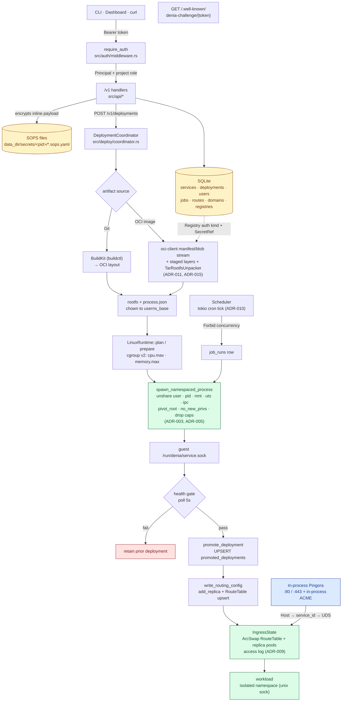

# Denia

> A Docker-free, single-node PaaS that runs your services on a Denia-owned Linux
> runtime — namespaces and cgroup v2 instead of Docker, containerd, or runc.

[](LICENSE)
[](https://www.rust-lang.org/)


Denia deploys and runs workloads under its own Linux runtime isolation and
exposes a versioned `/v1` management API behind a bearer admin token. It is its
own L7 ingress (in-process Pingora + ACME TLS), autoscales services down to zero,
and ships with an embedded web console — a single Rust binary, no external proxy,
no container runtime.

It is built for **solo operators and homelab users** running self-hosted
workloads on a single node: deploy services, manage routes and secrets, and read
real cgroup/procfs runtime metrics. The goal is a tool you trust enough to forget
about, opening it only to do a thing and leave.

> **Status: v1, single-node.** Multi-node scheduling, hosted registry push, and
> rootless operation are intentionally deferred. See the ADRs under `docs/adr/`.

## Features

- **Denia-owned runtime isolation** — workloads run under `unshare(user, pid,
  mount, uts, ipc)` + cgroup v2 + `no_new_privs` + a dropped capability bounding
  set. No Docker, containerd, or runc. Each replica boots a private per-replica
  overlay filesystem (ADR-019).
- **In-process L7 ingress** — an embedded Pingora (0.8, boringssl) proxy binds
  `:80`/`:443`, resolves the `Host` header to a service, and dials the workload's
  Unix socket directly. No Traefik, no loopback bridge (ADR-020).
- **In-process TLS / ACME** — per-SNI certs issued and renewed via `instant-acme`
  (HTTP-01); no certbot, no sidecar (ADR-007/ADR-020).
- **Horizontal autoscaling** — per-service CPU/memory-driven scaling with
  scale-to-zero and single-flight cold-start, bounded by a host resource ledger
  (ADR-018).
- **Two artifact sources** — Git over SSH built with BuildKit, and external OCI
  image pulls done **in-process** via `oci-client` (no `skopeo`/`umoci`)
  (ADR-011/ADR-015).
- **Projects + RBAC** — services grouped into projects with shared env/limits;
  project-scoped Viewer/Operator/Admin roles on every `/v1` route (ADR-006/ADR-008).
- **Jobs** — run-to-completion jobs with cron schedules and an in-process tokio
  scheduler (ADR-010).
- **SOPS-referenced secrets** — SQLite stores references only; raw secret values
  live in SOPS-encrypted files encrypted to a host-local age identity (ADR-021/ADR-023).
- **Embedded web console** — a static SPA served from the same binary on the same
  origin as `/v1` (ADR-004).

## Quick Start

For local development on a Linux host:

```bash
# 1. Build the web console (embedded into release builds)
cd web && pnpm install && pnpm build && cd ..

# 2. Set the bootstrap admin token (required)
export DENIA_ADMIN_TOKEN="$(openssl rand -hex 32)"

# 3. Run the control plane
cargo run --release
```

The server binds `127.0.0.1:7180` by default, serving the API under `/v1` with
the console as the fallback for non-API routes. For a production install, use the
[Installation](#installation) flow instead.

## Requirements

- **Rust 2024 edition** (stable toolchain).
- **Linux glibc ≥ 2.39** with **cgroup v2** and **systemd** (Ubuntu 24.04+
  baseline). Kernel **≥ 5.11** for overlayfs mounts inside the workload user
  namespace (per-replica isolation, ADR-019).
- **`sops`** for secret encryption/decryption.
- **BuildKit** (`buildctl`) — only for Git artifact sources. OCI image
  acquisition is in-process (no `skopeo`/`umoci`); `no_new_privs` + capability
  drop are applied in-process via `rustix` (no `setpriv`).
- **`pnpm` + Node** — only to build the web console (TanStack Start). See `web/`.

## Installation

Production installs use a two-step flow.

**Step 1 — Build and install the binary:**

```bash
sudo ./install.sh
```

`install.sh` must be run via **sudo from a regular user account** (not directly
as root). It runs preflight checks (OS/arch, glibc ≥ 2.39, cgroup v2, user
namespaces, free `:80`/`:443`), installs OS dependencies, sets up Rust (via
`rustup`) and Node, builds the release binary with the embedded SPA, and
installs it to `/usr/local/bin/denia`.

- `--dry-run` previews every command without changing anything.
- `--skip-build` reuses an existing `target/release/denia`.

**Step 2 — Provision the host:**

```bash
sudo denia setup
```

`denia setup` creates the `denia` system user and group, lays out
`/var/lib/denia`, generates `~/.config/denia/{config.toml,admin.token,age.key}`
(owned `<operator>:denia 0640` — editable without sudo), writes and enables the
systemd unit, and starts the service. See
[ADR-025](docs/adr/025-cli-driven-host-provisioning.md) for the full layout and
privilege model.

### CLI subcommands

| Subcommand | Purpose |
|------------|---------|
| `denia setup` | Provision the host (user, dirs, keys, config, systemd unit, start). |
| `denia uninstall [--purge]` | Stop and remove the service; `--purge` also wipes `/var/lib/denia` and `~/.config/denia`. |
| `denia status` | Print service state (systemctl status + recent journal lines). |
| `denia doctor` | Diagnose host requirements and install health (no privilege needed). |
| `denia rotate-token` | Rotate the admin token and restart the service. |

Running `denia` with no subcommand starts the control-plane daemon.

### Bootstrap admin user

The token in `~/.config/denia/admin.token` is a super-admin bearer. Exchange it
once for a real admin account (or use the console's `/setup` page):

```bash
TOKEN="$(sed -n 's/^DENIA_ADMIN_TOKEN=//p' ~/.config/denia/admin.token)"
curl -fsS -X POST \
  -H "Authorization: Bearer $TOKEN" \
  -H 'Content-Type: application/json' \
  -d '{"username":"admin","password":"<strong-password>"}' \
  http://127.0.0.1:7180/v1/bootstrap
```

## Configuration

Configuration is read from a TOML file (`FileConfig` in `src/config.rs`); the
daemon writes a fully-populated default template on first boot. Every field can
be overridden by a `DENIA_*` environment variable — **env wins**. Path resolution
(first match wins): `$DENIA_CONFIG_FILE` → `$XDG_CONFIG_HOME/denia/config.toml` →
`$HOME/.config/denia/config.toml` → `/root/.config/denia/config.toml`. See
[ADR-023](docs/adr/023-toml-config-file.md).

Most-used settings (the full list lives in `src/config.rs`):

| Env override | TOML key | Default | Purpose |
|--------------|----------|---------|---------|
| `DENIA_ADMIN_TOKEN` | `admin_token` | auto-generated 64 hex | Bootstrap bearer for `/v1` (min 64 chars) |
| `DENIA_BIND_ADDR` | `bind_addr` | `127.0.0.1:7180` | Management API listen address |
| `DENIA_DATA_DIR` | `data_dir` | `/var/lib/denia` | Root for state, artifacts, runtime, logs |
| `DENIA_ACME_EMAIL` | `acme_email` | — | ACME account email (required when any service uses TLS) |
| `DENIA_HTTP_PORT` / `DENIA_HTTPS_PORT` | `http_port` / `https_port` | `80` / `443` | Pingora ingress ports |
| `DENIA_ACME_DIRECTORY_URL` | `acme_directory_url` | Let's Encrypt prod | Set the LE **staging** URL for non-prod to avoid rate-limit burns |
| `DENIA_AGE_KEY_FILE` | `age_key_file` | `~/.config/denia/age.key` | Age private key for SOPS; recipient auto-derived from it |

Registry credentials are not configured by env: POST the raw payload to
`/v1/projects/{project_id}/registries` and the control plane SOPS-encrypts it
(ADR-021).

## Architecture

A single Rust binary contains both the HTTP control plane and the node agent,
separated internally so they can split later if a multi-node ADR is accepted.

- **API** — `axum`, versioned under `/v1`, bearer-token protected.
- **State** — SQLite (`rusqlite`, bundled) for services, deployments, routes,
  credentials metadata, and recent metric snapshots. All persisted IDs are UUIDv7.
- **Secrets** — SOPS-encrypted files; SQLite holds **references only** (ADR-021/ADR-023).
- **Artifacts** — Git-over-SSH (BuildKit) and in-process OCI pulls (ADR-011/ADR-015).
- **Runtime** — `LinuxRuntime` launches workloads under namespaces + cgroup v2 +
  `no_new_privs` + bounded caps, each in a private overlay rootfs (ADR-003/ADR-005/ADR-019).
- **Autoscaling** — CPU/mem-driven scaling, scale-to-zero, host resource ledger (ADR-018).
- **Ingress / TLS** — in-process Pingora proxy + in-process ACME (ADR-020).
- **RBAC / Projects** — project-scoped roles and shared env/limits (ADR-006/ADR-008).
- **Jobs** — cron + manual run-to-completion jobs (ADR-010).
- **Observability** — access logs, service logs, node + service metrics from
  cgroup v2 / procfs / statvfs (ADR-009).

Source modules (`src/`): `api`, `app`, `auth`, `cli`, `command`, `config`,
`deploy`, `domain`, `repo`, `state`, `secrets`, `artifacts`, `oci`, `runtime`,
`ingress`, `observability`, `autoscale`, `scheduler`, `syscall`, `web`, and
`workload_launcher`.

Deployments are **health-gated**: Denia starts the new deployment, waits for the
configured HTTP health-check, then atomically promotes routing and retains the
previous deployment for rollback.

### Request & deployment flow



## API

`GET /healthz` is public. Everything under `/v1` requires `Authorization: Bearer
<token>` — either the bootstrap admin token (super-admin) or a session / API
token from `/v1/auth/login`. Routes enforce a project-scoped role minimum
(Viewer/Operator/Admin). The full route table is documented in
[ADR-008](docs/adr/008-rbac.md) and the `src/api/` handlers; highlights:

- `POST /v1/auth/login`, `GET /v1/me`, `POST /v1/bootstrap`
- `GET|POST /v1/projects`, `…/members`, `…/registries`
- `GET|POST /v1/services`, `GET /v1/services/{id}/{logs,metrics,requests,domains}`
- `POST /v1/deployments`, `GET /v1/services/{id}/deployments`
- `GET|POST /v1/jobs`, `POST /v1/jobs/{id}/run`, `GET /v1/jobs/{id}/runs`
- `GET /.well-known/denia-challenge/{token}` (public domain verification;
  token must match the request `Host`)

## Security

> **Treat `CAP_SYS_ADMIN` as host-root-equivalent for threat modeling.** Any RCE
> in the daemon escalates to host root — the same class as `dockerd`,
> `containerd`, `kubelet`, and rootful `podman`.

- **Trust model** — the daemon runs as the unprivileged `denia` user with a
  tightly-scoped capability set (`CAP_NET_BIND_SERVICE`, `CAP_SYS_ADMIN`,
  `CAP_SETUID`, `CAP_SETGID`). Workloads run in unprivileged user namespaces with
  `uid 0` mapped to `userns_base` (default `100000`). Denia v1 is **not** a
  multi-tenant adversarial sandbox — run untrusted code on its own host or VM.
- **Daemon hardening** — the shipped systemd unit applies `ProtectSystem=strict`,
  `ProtectHome=true` + `BindReadOnlyPaths=~/.config/denia`, `PrivateTmp=true`, and
  a locked `CapabilityBoundingSet=`.
- **Operational hygiene** — bind the management API to loopback (or front it with
  a reverse proxy + mTLS/VPN); rotate the admin token; patch the host kernel
  aggressively (the realistic escape vector is a userns/cgroup CVE); run
  `cargo audit` per release; never log secrets.

See `docs/security-audit-pingora-2026-05-28.md` and the ADRs for the full
analysis.

## Contributing

Read [`CLAUDE.md`](CLAUDE.md) / [`AGENTS.md`](AGENTS.md) and
[`docs/adr/README.md`](docs/adr/README.md) before changing anything. Architecture
changes (runtime isolation, ingress, secrets, persistence, API, dependencies)
need a new or updated ADR.

Verification commands:

```bash
cargo build
cargo test
cargo fmt --all
cargo clippy --all-targets --all-features

# privileged runtime tests (root, namespaces, mounts, cgroup v2) — opt-in:
DENIA_RUN_PRIVILEGED_TESTS=1 cargo test --test linux_runtime_privileged -- --ignored
```

Privileged runtime tests are gated because they require root and mutate
namespaces, mounts, and cgroups. Commit format: `<type>(<scope>): concise
message` where type is `feat`, `fix`, `docs`, `test`, or `refactor`. Never commit
secrets, local keys, or generated private config.

## License

Denia is licensed under the **Apache License 2.0** — see [`LICENSE`](LICENSE).
