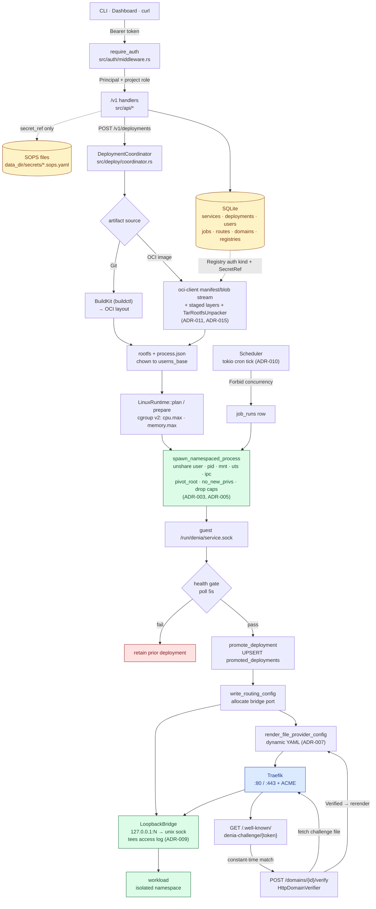

# Denia

Denia is a Docker-free, single-node PaaS. It deploys and runs services with a
Denia-owned Linux runtime (namespaces + cgroup v2) instead of Docker,
containerd, or runc, and exposes a versioned `/v1` management API behind a
bearer admin token.

It is built for solo operators and homelab users running self-hosted workloads
on a single node: deploy services, manage routes and secrets, and read real
cgroup/procfs runtime metrics. The goal is a tool you trust enough to forget
about, opening it only to do a thing and leave.

> Status: **v1, single-node.** Multi-node scheduling, hosted registry push, and
> rootless operation are intentionally deferred. See the ADRs and the active
> specs/plans under `docs/superpowers/`.

## Architecture

A single Rust binary contains both the HTTP control plane and the node agent,
separated internally so they can split later if a multi-node ADR is accepted.

- **HTTP API** — `axum`, versioned under `/v1`, protected by a bearer admin token.
- **State** — SQLite (`rusqlite`, bundled) for services, credentials metadata,
  artifacts, deployments, runtime status, bridge ports, routes, and recent
  metric snapshots.
- **Secrets** — SOPS-encrypted files; SQLite stores **references only**, never
  raw secret values. Default backend is a host-local age identity with
  root-only permissions.
- **Artifacts** — two v1 sources: Git over SSH built via BuildKit, and external
  OCI image pulls performed **in-process** via `oci-client` +
  `TarRootfsUnpacker` (no `skopeo`/`umoci` host binaries). Registry pulls stream
  layer blobs into temporary files under the artifact directory before verified
  extraction (ADR-015). Private registry auth is project-scoped through
  `Registry` records and SOPS `SecretRef`s, including Basic, bearer token,
  ECR-token, and GAR-token mappings (ADR-014).
- **Runtime** — `LinuxRuntime` launches workloads under `cgroup_v2 +
  unshare(user|pid|mount|uts|ipc) + no_new_privs + bounded-caps` and places
  them in `<cgroup_root>/<service_id>/<deployment_id>` cgroups. Host paths are
  keyed off the globally-unique `service_id`, so the same service name across
  projects is isolated on disk. Host root is the trust boundary; agent runs
  rootful.
- **Ingress** — Traefik file provider. Denia owns the loopback-bridge listeners
  that forward Traefik traffic to per-workload Unix sockets. Per-service TLS
  (`tls_enabled`) emits ACME-resolved `websecure` routers with HTTP→HTTPS
  redirect (ADR-007). The bridge tees the first HTTP request line and response
  status into an in-process access log (ADR-009).
- **RBAC** — Users, sessions, API tokens, and project-scoped roles
  (Viewer/Operator/Admin) plus a bootstrap super-admin. Every `/v1` route
  resolves a `Principal` and enforces a project-scoped role minimum (ADR-008).
- **Projects** — Services are grouped into projects with shared env and
  default resource limits; `effective_env` and `effective_limits` are merged
  into each runtime start (ADR-006).
- **Jobs** — Run-to-completion jobs with cron schedules + in-process
  tokio scheduler, run-history with status + exit code, and Forbid concurrency
  (409 on duplicate manual run) (ADR-010).
- **Observability** — Node CPU/mem/disk/load via procfs + statvfs, per-service
  request log + workload roll-up (ADR-009).
- **Metrics** — cgroup v2 + procfs, read by `service_id`.

Source modules (`src/`): `api`, `app`, `auth`, `command`, `config`, `deploy`,
`domain`, `repo`, `state`, `secrets`, `artifacts`, `oci` (in-process
puller/unpacker + credentials), `runtime`, `ingress` (bridge, socket proxy,
Traefik rendering), `observability` (access logs, service logs, service metrics,
node metrics), `scheduler`, `verification`, `syscall` (rustix chown/caps/ns +
signal), `web`, and `workload_launcher`.

Deployments are **health-gated**: Denia starts the new deployment, waits for the
configured HTTP health-check path and timeout, then atomically promotes routing
and retains the previous deployment for rollback.

## Workflow

End-to-end view of how a request reaches a workload, and how a deployment is
produced and promoted.



Key stage transitions in code: `create_deployment`
(`src/api/deployments.rs`) → `deploy_external_image_source` /
`deploy_git_source` (`src/deploy/coordinator.rs`) →
`ArtifactAcquirer::acquire_rootfs_bundle_from_image_config`
(`src/artifacts/acquirer.rs`) → `LinuxRuntime::plan` / `prepare`
(`src/runtime/linux.rs`) → `spawn_namespaced_process` (`src/syscall/ns.rs`) →
`wait_for_service_socket` (`src/runtime/fs_helpers.rs`) → `health.check` →
`promote_deployment` (`src/repo/sqlite/deployments.rs`) →
`write_routing_config` (`src/deploy/coordinator.rs`).

## Requirements

- Rust 2024 edition (stable toolchain).
- Linux host with **cgroup v2** and **systemd** (Ubuntu/Debian LTS baseline).
- `unshare` (util-linux) and `sops`. For Git sources: BuildKit (`buildctl`).
  OCI image acquisition is in-process — no `skopeo`/`umoci`. `no_new_privs` +
  capability-drop are applied via `rustix` in-process — no `setpriv`.
- For building the dashboard: `pnpm` + Node (TanStack Start). See `web/`.

## Build & Run

```bash
cargo build                 # baseline build
cargo build --release       # embeds the web dashboard from web/dist/client
```

The release binary embeds the built SPA (`web/dist/client`) via `rust-embed`. In
debug builds the assets are read from disk. Build the frontend first when you
want the console served:

```bash
cd web && pnpm install && pnpm build
```

Run the control plane:

```bash
export DENIA_ADMIN_TOKEN=<your-token>   # required
cargo run --release
```

The server binds `127.0.0.1:7180` by default and serves the API under `/v1`,
with the dashboard as a fallback for non-API routes.

## Configuration

All configuration is environment-driven (`src/config.rs`).

| Variable | Default | Purpose |
|----------|---------|---------|
| `DENIA_ADMIN_TOKEN` | — (**required**) | Bootstrap bearer token for `/v1`; minimum 32 chars |
| `DENIA_BIND_ADDR` | `127.0.0.1:7180` | Listen address |
| `DENIA_DATA_DIR` | `/var/lib/denia` | Root for state, artifacts, runtime, logs |
| `DENIA_DATABASE_PATH` | `<data_dir>/denia.sqlite3` | SQLite path |
| `DENIA_BUILDKIT_BINARY` | `buildctl` | BuildKit client binary |
| `DENIA_SOPS_BINARY` | `sops` | SOPS binary |
| `DENIA_SOCKET_PROXY_BINARY` | current executable | Binary injected into workload rootfs as the socket proxy |
| `DENIA_CGROUP_ROOT` | `/sys/fs/cgroup/denia` | Root for Denia-owned workload cgroups |
| `DENIA_BRIDGE_START_PORT` | `19000` | First loopback bridge port allocated for Traefik targets |
| `DENIA_TRAEFIK_DYNAMIC_CONFIG` | `/etc/traefik/dynamic/denia.yml` | Generated Traefik file-provider config |
| `DENIA_ACME_RESOLVER` | `le` | Traefik certResolver name used for `tls_enabled` services |
| `DENIA_CONTROL_DOMAIN` | — | Optional Traefik router for the control plane itself |
| `DENIA_CONTROL_TLS` | `false` | TLS on the control-plane router |
| `DENIA_USERNS_BASE` | `100000` | uid/gid base for the workload user namespace |
| `DENIA_USERNS_SIZE` | `65536` | uid/gid range size for the workload user namespace |
| `DENIA_NODE_DISK_PATH` | `<data_dir>` | Path used for `statvfs` disk metrics |

Derived paths: `runtime/`, `artifacts/`, `logs/`, and SOPS files under
`secrets/*.sops.yaml` below `DENIA_DATA_DIR`. Registry credentials are configured
as project-scoped `/v1/projects/{project_id}/registries` records that point at
SOPS secret refs; Denia no longer has `ecr`/`gar` Cargo features or
`DENIA_ECR_*` / `DENIA_GAR_*` process-wide registry auth variables.

## API

`GET /healthz` is public. Everything under `/v1` requires `Authorization:
Bearer <token>` — either the bootstrap admin token (super-admin) or a
user session / API token issued by `/v1/auth/login` (ADR-008).

| Method | Path | Min role | Purpose |
|--------|------|----------|---------|
| `GET` | `/healthz` | public | Liveness probe |
| `POST` | `/v1/auth/login` | public | Issue a session token |
| `POST` | `/v1/auth/logout` | authenticated | Revoke the bearer session |
| `GET` | `/v1/me` | authenticated | Current principal + memberships |
| `GET` / `POST` / `DELETE` | `/v1/users{,/...}` | super-admin | User management |
| `GET` / `POST` / `DELETE` | `/v1/api-tokens{,/...}` | authenticated | Caller's API tokens |
| `GET` | `/v1/projects` | viewer (membership-filtered) | List projects |
| `POST` | `/v1/projects` | super-admin | Create a project |
| `GET` | `/v1/projects/{id}` | viewer | Project detail |
| `DELETE` | `/v1/projects/{id}` | admin | Delete (only when empty) |
| `GET` / `POST` / `DELETE` | `/v1/projects/{id}/members{,/...}` | admin | Project membership |
| `GET` / `POST` | `/v1/projects/{id}/registries` | admin | List / create project registry auth config |
| `GET` / `PATCH` / `DELETE` | `/v1/projects/{id}/registries/{registry_id}` | admin | Registry detail / update / delete |
| `POST` | `/v1/credentials/{git,registry}` | super-admin | Register a SOPS-referenced credential |
| `GET` | `/v1/services` | viewer (membership-filtered) | List services |
| `POST` | `/v1/services` | operator | Create/update a service config |
| `POST` | `/v1/deployments` | operator | Create a deployment (Git or external image) |
| `GET` | `/v1/services/{id}/deployments` | viewer | List deployments |
| `GET` | `/v1/services/{id}/logs` | operator | Service logs |
| `GET` | `/v1/services/{id}/metrics` | viewer | cgroup snapshots |
| `GET` | `/v1/services/{id}/requests` | operator | Recent access-log entries |
| `GET` / `POST` | `/v1/services/{id}/domains` | viewer / operator | List / add a domain (HTTP-verified before routing) |
| `POST` | `/v1/services/{id}/domains/{domain_id}/verify` | operator | Trigger HTTP file verification (409 if in flight) |
| `DELETE` | `/v1/services/{id}/domains/{domain_id}` | operator | Remove a domain |
| `GET` | `/.well-known/denia-challenge/{token}` | public | Verification challenge file (no auth; token is the secret) |
| `POST` | `/v1/services/{id}/{action}` | operator | Lifecycle (`stop`) |
| `GET` | `/v1/jobs?project_id=...` | viewer | List jobs |
| `POST` | `/v1/jobs` | operator | Create a job (cron or manual) |
| `GET` / `DELETE` | `/v1/jobs/{id}` | viewer / operator | Job detail / delete |
| `POST` | `/v1/jobs/{id}/run` | operator | Manual trigger (409 if a run is active) |
| `GET` | `/v1/jobs/{id}/runs` | viewer | Run history |
| `GET` | `/v1/ingress/routes` | super-admin | Live RouteSpec snapshot |
| `GET` | `/v1/ingress/config` | super-admin | Live Traefik dynamic YAML |
| `GET` | `/v1/metrics/node` | super-admin | NodeSnapshot (CPU/mem/disk/load) |
| `GET` | `/v1/workloads` | viewer (membership-filtered) | Running-workload roll-up |

Credentials store only a `secret_ref` pointing at a SOPS-encrypted file; raw
secret material never enters SQLite or logs.

## Dashboard

The operator dashboard lives in `web/` (TanStack Start / React 19, with an
Effect logic layer beneath TanStack Query). It is mono-forward and dark-primary
— see `PRODUCT.md` and `DESIGN.md` for the product brief and design system. The
built client is embedded into the release binary and served as the fallback for
non-`/v1` routes. Frontend work is out of scope for backend changes unless
explicitly requested.

## Verification

```bash
cargo build
cargo test
cargo fmt --all
cargo clippy --all-targets --all-features

# privileged runtime tests (root, namespaces, mounts, cgroup v2) — opt-in:
DENIA_RUN_PRIVILEGED_TESTS=1 cargo test --test linux_runtime_privileged -- --ignored
```

Privileged runtime tests are gated because they require root and mutate
namespaces, mounts, and cgroups. Normal CI stays unprivileged and covers
planning, path safety, and cgroup-file preparation against temp directories.
For narrower contract checks, `cargo test --test backend_contract` covers API
and deployment behavior, while `cargo test --test repo_contract` covers the
per-aggregate SQLite repositories.

## Security

- Host root is the explicit trust boundary; the agent runs rootful by design.
- Never commit secrets, local keys, or generated private config.
- Never log passwords, tokens, SSH private keys, registry credentials, or
  decrypted SOPS payloads.
- External input is validated at API and runtime boundaries (service names,
  secret refs, process manifests).

## References

- `docs/adr/README.md` and the ADRs: `001` backend architecture, `002` frontend
  Effect layer, `003` Linux runtime process runner (in-process namespace adapter
  amendment), `004` embedded web console, `005` runtime security hardening,
  `006` projects + versioned migrations, `007` ingress + TLS, `008`
  project-scoped RBAC, `009` observability, `010` jobs scheduler, `011`
  in-process OCI acquisition, `012` `src/` modularization, `013` domain
  verification, `014` per-service registry, `015` streaming OCI layer staging.
- `docs/superpowers/specs/` and `docs/superpowers/plans/` — design specs and
  implementation plans used to track active backend and console work.
- `CLAUDE.md` — agent/contributor guidelines.
- [Rust](https://www.rust-lang.org/) · [Axum](https://docs.rs/axum/) ·
  [SOPS](https://getsops.io/) ·
  [Traefik file provider](https://doc.traefik.io/traefik/providers/file/)
